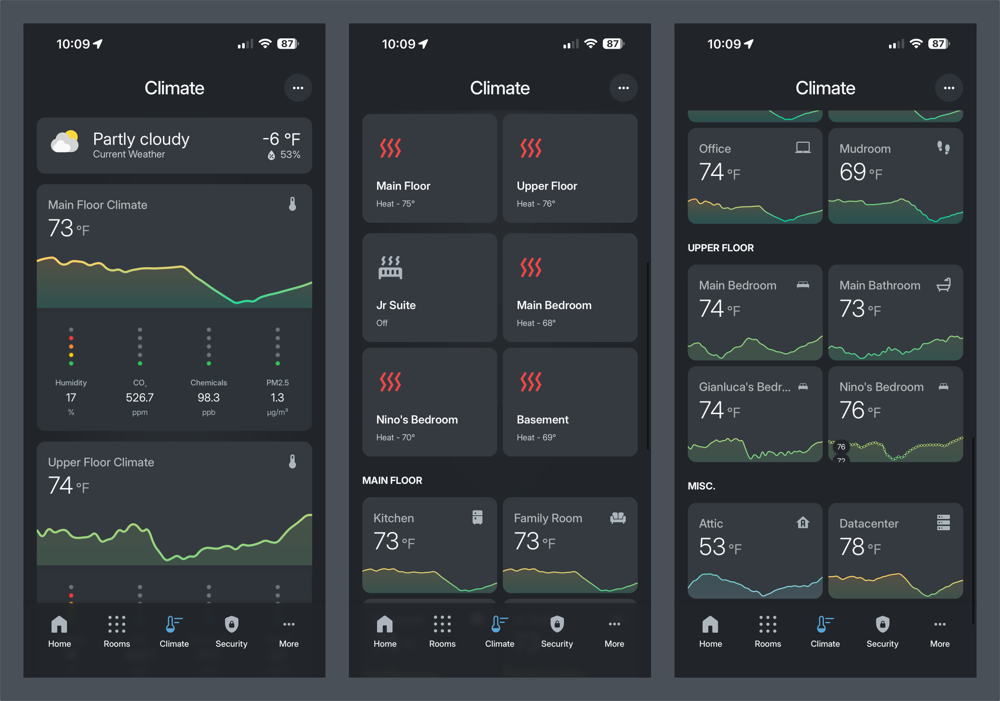

# Climate Dashboard



Comprehensive climate control and monitoring for the entire house. Monitor temperatures, air quality, weather conditions, and control HVAC systems across all floors and rooms.

## Overview

The Climate dashboard provides:

- **Current Weather** - Real-time weather conditions and forecasts
- **Floor-Level Climate Overview** - Temperature graphs and air quality monitoring for Main Floor and Upper Floor
- **HVAC Controls** - Thermostat controls for main HVAC systems (Nest thermostats)
- **Radiant Floor Heating** - Zone-based radiant floor heating controls (Ecobee thermostats)
- **Room Temperature Monitoring** - Individual room temperature cards organized by floor
- **Weather Popup** - Detailed weather forecasts, precipitation, AQI, allergies, and astronomical data
- **Thermostat Popups** - Full control interfaces for each HVAC zone
- **Settings Popup** - Climate automation toggles and configuration

## File Structure

```
climate/
├── README.md                              # This file
├── climate.yaml                           # Main climate dashboard page
├── _main_floor_thermostat_popup.yaml     # Main floor Nest thermostat popup
├── _upper_floor_thermostat_popup.yaml    # Upper floor Nest thermostat popup
└── weather_popup.yaml                     # Weather details popup
```

## Page Structure

### 1. Top Toolbar

Standard toolbar with:
- **Page Title** - "Climate"
- **Settings Button** - Opens climate settings popup

Uses `top_toolbar` decluttering template.

### 2. Current Weather

Quick weather overview card showing:
- **Current Conditions** - Temperature, condition, and icon
- **Tap Action** - Opens detailed weather popup

Uses `weather-forecast` card with `show_current: true`.

### 3. Floor Climate Overview

Two climate overview sections (Main Floor and Upper Floor) showing:

- **Temperature Graph** - 24-hour temperature history with color-coded thresholds
- **Air Quality Indicators** - Horizontal stack of AQI sensors:
  - Humidity
  - Carbon Dioxide (CO2)
  - VOCs (Volatile Organic Compounds)
  - PM2.5 (Particulate Matter)

Uses `climate_overview` decluttering template.

### 4. HVAC Controls

2-column grid of main HVAC thermostats:
- **Main Floor** - Nest thermostat for main floor
- **Upper Floor** - Nest thermostat for upper floor

Each thermostat card:
- Shows current temperature and setpoint
- Displays HVAC mode (heat, cool, auto, off)
- Tap to open detailed thermostat popup

Uses `kohbo_thermostat_entity` button card template.

### 5. Radiant Floor Heating

Conditional section that appears when radiant floor heating is off:
- **Group Toggle** - Master on/off for all radiant floor zones

When radiant floor heating is on, displays a 2-column grid of zone thermostats:
- **Jr Suite** - Radiant floor zone control
- **Main Bedroom** - Radiant floor zone control
- **Nino's Bedroom** - Radiant floor zone control
- **Basement** - Radiant floor zone control

Each zone card opens a detailed thermostat popup when tapped.

### 6. Room Temperature Monitoring

Organized by floor sections:

#### Main Floor Rooms
- Kitchen
- Family Room
- Playroom
- Jr. Suite
- Office
- Mudroom

#### Upper Floor Rooms
- Main Bedroom
- Main Bathroom
- Gianluca's Bedroom
- Nino's Bedroom

#### Misc. Areas
- Attic
- Datacenter (Basement)

Each room displays:
- Room name with icon
- Current temperature
- Color-coded status based on temperature thresholds

Uses `kohbo_room_temperature_card` decluttering template.

## Popups


### Weather Popup

**Access:** Tap on the current weather card

**Contents:**
- **Current Weather Overview** - Large temperature display with condition icon
- **Weather Details** - Feels like temperature, daily high/low
- **Precipitation Forecast** - 10-hour precipitation graph (shown when raining or rain incoming)
- **Weather Forecast Tabs**:
  - **Hourly** - 14-hour hourly forecast
  - **Outlook** - 14-day daily forecast
- **Sun Information** - Next sunrise/sunset with countdown
- **Daily Forecast** - 7-day forecast with temperature bars
- **Air Quality Section**:
  - AQI (Air Quality Index)
  - Humidity
  - Ozone
  - PM2.5
- **Allergies** - Horizontal scrollable pollen levels:
  - Weeds
  - Grass
  - Trees
  - Poaceae
  - Ragweed
- **Horizon** - Sun and moon phase visualization

**Implementation:** Uses `custom:bubble-card` with `pop-up` card type, includes `custom:simple-weather-card`, `custom:apexcharts-card`, `custom:clock-weather-card`, and `custom:horizon-card`.

### Thermostat Popups

#### Main Floor & Upper Floor Thermostats

**Access:** Tap on Main Floor or Upper Floor thermostat cards

**Contents:**
- **Thermostat Control** - Full thermostat interface with:
  - Temperature setpoint adjustment
  - HVAC mode selection (heat, cool, auto, off, eco)
  - Fan controls
- **Indoor Temperature** - Current room temperature
- **Outside Temperature** - Current outdoor temperature
- **Eco Mode Indicator** - Shows when thermostat is in eco mode
- **Quick Actions** - Preset temperature buttons and mode shortcuts

**Implementation:** Uses `thermostat_popup` decluttering template.

#### Radiant Floor Thermostats

**Access:** Tap on individual radiant floor zone cards (Jr Suite, Main Bedroom, Nino's Bedroom, Basement)

**Contents:**
- **Zone Thermostat Control** - Full control interface
- **Indoor Temperature** - Current zone temperature
- **Outside Temperature** - Current outdoor temperature
- **Zone-specific controls** - Radiant floor heating adjustments

**Implementation:** Uses `thermostat_radiant_floor_popup` decluttering template.

### Radiant Floor Heating Popup

**Access:** Tap on the Radiant Floor Heating group toggle when off

**Contents:**
- **Zone Controls** - Individual climate cards for each radiant floor zone:
  - Main Bedroom
  - Nino's Bedroom
  - Jr Suite
  - Basement
- Each zone card shows:
  - Current temperature
  - HVAC mode
  - Last changed timestamp
  - Mode selection menu

**Implementation:** Uses `custom:bubble-card` with individual `card_type: climate` cards.

### Settings Popup

**Access:** Tap the settings icon in the top toolbar

**Contents:**

#### General Automations
- **Pre-Heat/Cool in Morning** - Morning climate preparation automation
- **Activate Climate When Nearly Home** - Geofence-based climate activation
- **High Energy Price Automations** - Energy-aware climate adjustments

#### Automatically Resume Climate
- **Main Floor Climate Resume Automation** - Auto-resume when house becomes occupied
- **Second Floor Climate Resume Automation** - Auto-resume based on room occupancy

#### Eco-Mode Automations
- **Main Floor Auto Eco Mode** - Automatically enable eco mode when unoccupied
- **Second Floor Auto Eco Mode** - Automatically enable eco mode when unoccupied

#### Severe Weather
- **Severe Weather Warning** - Weather alert automation
- **Severe Rain Incoming** - Rain prediction alerts
- **Tempest Rain Alert** - Real-time rain detection
- **High UV Alert** - UV index warnings

**Implementation:** Uses `custom:bubble-card` with `pop-up` card type, includes `entities` cards for automation toggles.

## Components Used

### Decluttering Templates

- `climate_overview` - Floor-level climate monitoring with temperature graph and AQI indicators
- `thermostat_popup` - Main HVAC thermostat control popup
- `thermostat_radiant_floor_popup` - Radiant floor zone thermostat popup
- `kohbo_room_temperature_card` - Individual room temperature display cards
- `top_toolbar` - Standard page header toolbar

### Button Card Templates

- `kohbo_thermostat_entity` - Thermostat control cards
- `kohbo_header_page_title` - Page title in header
- `kohbo_header_chip_card` - Header action buttons (settings)
- `kohbo_popup_page_title` - Popup titles
- `section_title` - Section headers
- `kohbo_card_small_header` - Small section headers
- `kohbo_allergy_card` - Pollen/allergy level cards
- `kohbo_card_section_description` - Descriptive text cards

### Layout Components

- `custom:vertical-layout` - Main page container
- `custom:stack-in-card` - Stacked card sections
- `grid` - Device grid layouts
- `custom:bubble-card` - Popup containers
- `custom:mod-card` - Card modification wrapper

### Custom Cards

- `weather-forecast` - Weather display card
- `thermostat` - Thermostat control card
- `custom:simple-weather-card` - Enhanced weather display
- `custom:apexcharts-card` - Precipitation and forecast graphs
- `custom:clock-weather-card` - Daily forecast display
- `custom:horizon-card` - Sun/moon phase visualization
- `custom:mini-graph-card` - Temperature history graphs

## Key Sensors

### Temperature Sensors

| Sensor | Purpose |
|--------|---------|
| `sensor.main_floor_temperature` | Main floor average temperature |
| `sensor.second_floor_temperature` | Upper floor average temperature |
| `sensor.tempest_temperature` | Outdoor temperature (Tempest weather station) |
| `sensor.{room}_awair_temperature` | Room-specific temperatures (Awair sensors) |
| `sensor.{room}_mean_temperature` | Room average temperatures (multiple sensors) |

### Air Quality Sensors

| Sensor | Purpose |
|--------|---------|
| `sensor.main_floor_air_quality_pm2_5` | Main floor PM2.5 levels |
| `sensor.main_floor_air_quality_co2` | Main floor CO2 levels |
| `sensor.main_floor_air_quality_tvoc` | Main floor TVOC levels |
| `sensor.main_floor_air_quality_score` | Main floor AQI score |
| `sensor.upper_floor_air_quality_*` | Upper floor air quality sensors |

### Climate Entities

| Entity | Purpose |
|--------|---------|
| `climate.nest_main_floor` | Main floor Nest thermostat |
| `climate.nest_2nd_floor` | Upper floor Nest thermostat |
| `climate.main_bedroom` | Main bedroom radiant floor zone |
| `climate.ninos_bedroom` | Nino's bedroom radiant floor zone |
| `climate.jr_suite` | Jr Suite radiant floor zone |
| `climate.basement` | Basement radiant floor zone |

### Weather Entities

| Entity | Purpose |
|--------|---------|
| `weather.kpwk` | Primary weather source |
| `weather.pirateweather` | Detailed weather forecasts |
| `weather.tempest_weather_station` | Tempest weather station data |

## Example YAML

### Climate Overview

```yaml
- type: custom:decluttering-card
  template: climate_overview
  variables:
    - room_name: Main Floor
    - navigation_path: /dashboard-kohbo/climate
    - temperature_sensor: sensor.main_floor_temperature
    - humidity_sensor: sensor.main_floor_humidity
    - pm25_sensor: sensor.main_floor_air_quality_pm2_5
    - carbon_dioxide_sensor: sensor.main_floor_air_quality_co2
    - vocs_sensor: sensor.main_floor_air_quality_tvoc
    - aqi_score_sensor: sensor.main_floor_air_quality_score
```

### Thermostat Card

```yaml
- type: custom:button-card
  entity: climate.nest_main_floor
  name: Main Floor
  template: kohbo_thermostat_entity
  tap_action:
    action: navigate
    navigation_path: '#main_floor_thermostat'
```

### Room Temperature Card

```yaml
- type: custom:decluttering-card
  template: kohbo_room_temperature_card
  variables:
    - name: Office
    - entity: sensor.office_awair_temperature
    - icon: kohbo:kohbo-laptop
```

### Thermostat Popup

```yaml
- type: custom:decluttering-card
  template: thermostat_popup
  variables:
    - hash: "#main_floor_thermostat"
    - entity: climate.nest_main_floor
    - eco_mode: binary_sensor.main_floor_nest_in_eco
    - name: Main Floor
    - temperature_sensor: sensor.main_floor_temperature
    - outside_temperature_sensor: sensor.tempest_temperature
```

## Navigation

The Climate dashboard integrates with:

- **Home Dashboard** - Shows climate overview in main view
- **Rooms Dashboard** - Individual rooms link to climate popups
- **Bottom Navigation** - Accessible via main navigation bar

## Temperature Thresholds

The climate dashboard uses color-coded temperature thresholds for visual feedback:

### Temperature Graph Colors

| Color | Range | Meaning |
|-------|-------|---------|
| 🔵 Blue | < 45°F | Very Cold |
| 🔵 Light Blue | 45-67°F | Cool |
| 🟢 Green | 67-78°F | Comfortable |
| 🟡 Yellow | 78-90°F | Warm |
| 🔴 Red | > 90°F | Hot |

### Room Temperature Card Thresholds

Room temperature cards use configurable thresholds (typically 5 values) for color coding based on room-specific comfort ranges.

## Air Quality Monitoring

The dashboard monitors multiple air quality metrics:

- **PM2.5** - Fine particulate matter (0-150+ µg/m³)
- **CO2** - Carbon dioxide levels (400-4500+ ppm)
- **TVOC** - Total Volatile Organic Compounds (0-25000+ ppb)
- **Humidity** - Relative humidity (0-100%)
- **AQI Score** - Overall air quality index (0-100+)

Each metric has color-coded thresholds indicating acceptable, moderate, poor, and hazardous levels.

## Automation Integration

The Climate dashboard integrates with various automations:

- **Climate Resume** - Automatically reactivate HVAC when house becomes occupied
- **Eco Mode** - Automatically enable eco mode when unoccupied
- **Energy Price** - Adjust climate based on real-time electricity prices
- **Weather Alerts** - Notifications for severe weather, rain, and high UV
- **Morning Pre-conditioning** - Pre-heat/cool house before wake time
- **Geofence** - Activate climate when approaching home

All automations can be toggled on/off via the Settings popup.

---

## Dashboard Navigation

[🏠 Home](../home/README.md) | [🏡 Rooms](../rooms/README.md) | [🌡️ Climate](../climate/README.md) | [🔒 Security](../security/README.md) | [⚡ Energy](../energy/README.md) | [👥 People](../more/PEOPLE_README.md)

📖 [Main Dashboard README](../../README.md)
