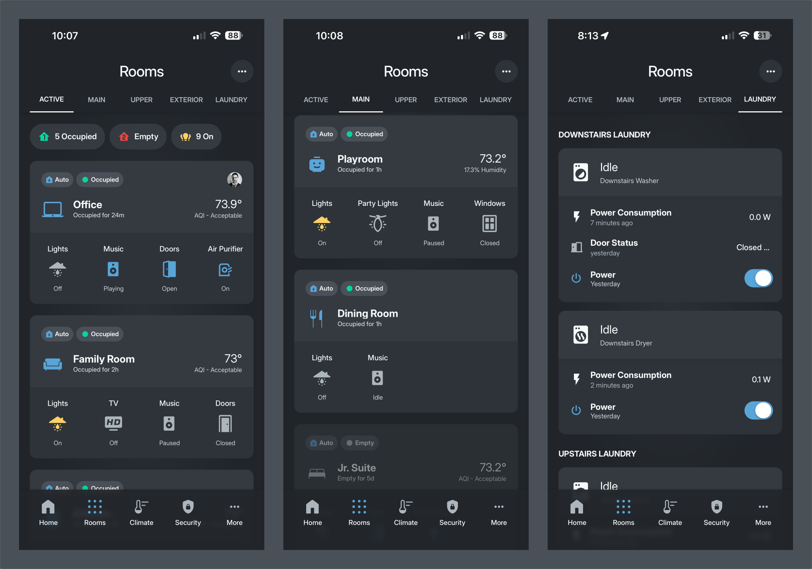
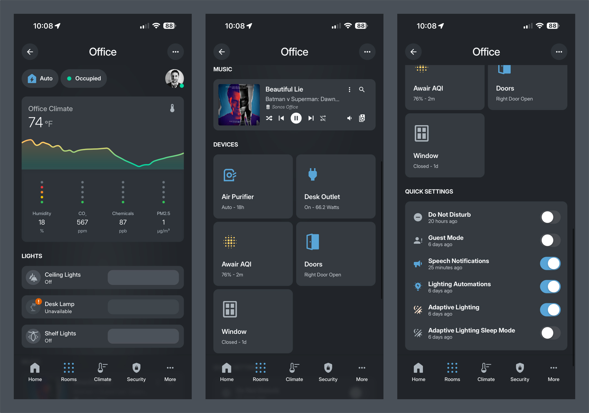

# Rooms Dashboard

Room-by-room control and monitoring for the entire house. Navigate by floor or see only occupied rooms for quick access to room controls, climate, devices, and automations.




## Overview

The Rooms dashboard provides:

- **Active Rooms View** - See only currently occupied rooms for quick access
- **Floor Indexes** - Browse all rooms organized by floor (Main Floor, Upper Floor)
- **Room Detail Pages** - Full control pages for each room with climate, lights, devices, and settings
- **Room Cards** - Quick status cards showing occupancy, temperature, and key devices


## File Structure

```
rooms/
├── README.md                              # This file
├── active_rooms.yaml                      # Active/occupied rooms view
├── main_floor/
│   ├── main_floor_index.yaml              # Main floor room index
│   ├── office.yaml                        # Office room detail page
│   ├── family_room.yaml                   # Family room detail page
│   ├── kitchen.yaml                       # Kitchen detail page
│   ├── playroom.yaml                      # Playroom detail page
│   ├── dining_room.yaml                   # Dining room detail page
│   ├── jr_suite.yaml                      # Jr. Suite detail page
│   ├── foyer.yaml                         # Foyer detail page
│   ├── mudroom.yaml                       # Mudroom detail page
│   ├── vacuum.yaml                        # Vacuum control page
│   └── partials/                          # Room card definitions
│       ├── office_card.yaml
│       ├── family_room_card.yaml
│       ├── kitchen_card.yaml
│       └── ...
├── upper_floor/
│   ├── upper_floor_index.yaml             # Upper floor room index
│   ├── main_bedroom.yaml                  # Main bedroom detail page
│   ├── ninos_bedroom.yaml                 # Nino's bedroom detail page
│   ├── gianlucas_bedroom.yaml             # Gianluca's bedroom detail page
│   ├── upstairs_hallway.yaml              # Upstairs hallway detail page
│   └── partials/                          # Room card definitions
│       ├── main_bedroom_card.yaml
│       ├── ninos_bedroom_card.yaml
│       └── ...
├── laundry/
│   └── laundry.yaml                       # Laundry room detail page
└── partials/                              # Shared room card collections
    ├── main_floor_room_cards.yaml
    ├── upper_floor_room_cards.yaml
    └── ...
```


## Active Rooms View

**Path:** `/dashboard-kohbo/rooms-active`

Shows only rooms that are currently occupied, making it easy to quickly access rooms in use.

### Features

- **Floor Status Chips** - Shows occupancy count for Main Floor and Upper Floor
- **Lights Status** - Quick view of interior lights state
- **Conditional Room Cards** - Only displays rooms where `input_boolean.{room}_occupied` is `on`
- **Media Player Popups** - Quick access to room media players

### Room Cards Displayed

Rooms appear automatically when occupied:
- Office
- Family Room
- Kitchen
- Playroom
- Dining Room
- Jr. Suite
- Main Bedroom
- Nino's Bedroom
- Gianluca's Bedroom
- Foyer
- Mudroom
- Upstairs Hallway


## Floor Index Pages

### Main Floor Index

**Path:** `/dashboard-kohbo/rooms-main-floor`

Shows all main floor rooms regardless of occupancy status.

**Overview Chips:**
- Occupancy status for main floor
- Main floor lights status
- Average temperature
- Motion sensor status

**Rooms Displayed:**
- Office
- Family Room
- Kitchen
- Playroom
- Dining Room
- Jr. Suite
- Foyer
- Mudroom

### Upper Floor Index

**Path:** `/dashboard-kohbo/rooms-upper-floor`

Shows all upper floor rooms regardless of occupancy status.

**Overview Chips:**
- Occupancy status for upper floor
- Upper floor lights status
- Second floor temperature
- Motion sensor status

**Rooms Displayed:**
- Main Bedroom
- Nino's Bedroom
- Gianluca's Bedroom
- Upstairs Hallway


## Room Detail Pages



Each room has a dedicated detail page with full control and monitoring capabilities.

### Page Structure

#### 1. Top Toolbar

Standard toolbar with:
- **Back Button** - Returns to floor index
- **Room Name** - Displayed as page title
- **Settings Button** - Opens room-specific settings popup

Uses `room_page_top_toolbar` decluttering template.

#### 2. Room Overview

Quick status section showing:
- **Occupancy** - Current occupancy state with icon
- **Room Mode** - Current room mode (e.g., Normal, Sleep, Focus)
- **People Present** - List of people currently in the room (BLE presence)

Uses `room_overview` decluttering template.

#### 3. Climate Overview

Room-specific climate monitoring:
- **Temperature** - Current room temperature
- **Humidity** - Current room humidity
- **Air Quality** - PM2.5, CO2, TVOC sensors (if available)
- **Quick Link** - Opens detailed climate popup with graphs

Uses `climate_overview_linkable` decluttering template.

#### 4. Lights Section

Individual light controls:
- **Ceiling Lights** - Main room lighting (often opens popup for individual control)
- **Desk Lamps** - Task lighting
- **Shelf/Accent Lights** - Decorative lighting
- **Brightness Controls** - Inline brightness sliders

Uses `tile` cards with light-brightness features.

#### 5. Music Section

Media player controls:
- **Current Track** - Now playing information
- **Playback Controls** - Play, pause, volume
- **Quick Access** - Opens full media player popup

Uses `media_player` decluttering template.

#### 6. Devices Section

2-column grid of room devices:
- **Air Purifiers** - Fan controls and filter status
- **Smart Plugs** - Power outlet controls
- **Doors** - Door status (open/closed)
- **Windows** - Window status (open/closed)
- **AQI Sensors** - Air quality monitoring
- **Other Devices** - Room-specific devices

Uses device button card templates (`kohbo_device_air_purifier_entity`, `kohbo_device_smart_plug_entity`, etc.).

#### 7. Quick Settings

Toggle switches for room-specific automations:
- **Do Not Disturb** - Disable notifications for room
- **Guest Mode** - Guest-specific settings
- **Speech Notifications** - Enable/disable voice announcements
- **Lighting Automations** - Room lighting automation toggle
- **Adaptive Lighting** - Circadian lighting controls
- **Adaptive Lighting Sleep Mode** - Night mode for adaptive lighting

#### 8. Popups


Each room can have multiple popups that provide detailed control and information:

##### Settings Popup

**Access:** Tap the settings icon in the top toolbar

**Contents:**
- **Automations Section** - Toggle room-specific automations on/off, examples from the Office:
  - Air Quality Automations
  - Music Automation
  - Deep Work Lighting
  - Treadmill Off
  - Vacuum Cleaning Automations
  - Other room-specific automations
- **Sensors Section** - Monitor room sensor status, examples from the Office:
  - BLE Base Station status
  - Occupancy Sensor status
  - Motion Sensor status
  - Air Purifier Filter Life
  - Other room sensors

**Implementation:** Uses `custom:bubble-card` with `pop-up` card type, accessed via hash navigation (e.g., `#office_settings_popup`).

##### Scene Selector (Light Popup)

**Access:** Tap on ceiling lights or other grouped light entities

**Contents:**
- **More Info Card** - Full light control interface with brightness, color temperature, and color picker
- **Scene Categories** - Organized swipeable scene collections:
  - **Default Scenes** - Rest, Relax, Read, Concentrate, Bright, Dimmed, Nightlight
  - **Color Scenes** - Tokyo, Soho, Tyrell, Resplendent, Futuristic, Soho, Vapor Wave, Megneto, Disturbia, Hal
  - **Halloween Scenes** - Halloween-specific lighting scenes
  - **Christmas Scenes** - Snow Sparkle, Under The Tree, Nutcracker, Jolly, Golden Star

**Features:**
- Swipeable horizontal carousel for each scene category
- Individual scene buttons that activate Hue-like scene presets
- Works with any color-capable light entity (not limited to Hue lights)
- Each scene applies to all lights in the light group
- Scene presets provide consistent, curated color combinations

**Implementation:** 
- Uses `light_popup` decluttering template with `simple-swipe-card` for scene navigation
- Powered by the [Scene Presets](https://github.com/Hypfer/hass-scene_presets) integration (available via HACS)
- Scene buttons call the `scene_presets.apply` service with preset scene IDs

##### Music Popup

**Access:** Tap on the media player section or the "Music" quick access button

**Contents:**
- **Full Media Player Interface** - Complete control using the Mediocre Massive Media Player card:
  - Now playing information (track, artist, album art)
  - Playback controls (play, pause, skip, volume)
  - Speaker group selection
  - Queue management
  - Source selection
  - Equalizer controls

**Features:**
- Full-screen media player experience
- Speaker grouping across all Sonos devices
- Access to all media sources and services
- Queue browsing and management

**Implementation:** Uses `media_player_pop_up` decluttering template with `mediocre-massive-media-player-card`.

##### Climate Popup

**Access:** Tap on the climate overview section

**Contents:**
- **Temperature Graph** - 24-hour temperature history with indoor/outdoor comparison
- **Air Quality Overview** - Current AQI status with contextual messaging
- **Detailed Sensor Grid** - Individual sensor cards showing:
  - Temperature (12-hour graph)
  - AQI Score (12-hour graph)
  - Humidity
  - Carbon Dioxide (CO2)
  - VOCs (Volatile Organic Compounds)
  - PM2.5 (Particulate Matter)

**Features:**
- Color-coded thresholds for each sensor type
- Historical graphs with smooth transitions
- Indoor vs. outdoor temperature comparison
- Contextual status messages based on conditions

**Implementation:** Uses `custom:bubble-card` with `pop-up` card type, includes `custom:mini-graph-card` and `custom:apexcharts-card` for visualizations.


## Room Cards

Room cards are reusable components used in floor indexes and the active rooms view. They provide a compact overview of room status.

### Card Components

Each room card displays:

- **Room Icon** - Custom icon representing the room
- **Room Name** - Display name
- **Occupancy Status** - Visual indicator (occupied/empty)
- **Room Mode** - Current room mode badge
- **Temperature** - Current room temperature (if sensor available)
- **Humidity** - Current room humidity (if sensor available)
- **AQI Status** - Air quality indicator (if sensor available)
- **Quick Device Controls** - 2-4 key devices (lights, music, doors, air purifier)

### Room Card Template

Room cards use the `room_card` decluttering template with variables:

```yaml
- type: custom:decluttering-card
  template: room_card
  variables:
    - mode: input_select.office              # Room mode selector
    - occupancy: input_boolean.office_occupied  # Occupancy boolean
    - room: "office"                         # Room slug
    - room_name: Office                      # Display name
    - navigation_path: '/dashboard-kohbo/rooms-office'  # Detail page path
    - icon: kohbo:kohbo-laptop               # Room icon
    - temperature: "[[[ return states['sensor.office_awair_temperature'].state ]]]"
    - humidity: "[[[ return states['sensor.office_awair_humidity'].state ]]]"
    - aqi: "[[[ return states['sensor.office_air_quality'].state ]]]"
    - room_devices:                          # Quick device buttons
      - type: custom:button-card
        entity: light.office_lights
        name: Lights
        template: kohbo_room_card_device
        icon: kohbo:kohbo-device-lights
```

### Room Card Device Buttons

Quick device buttons use `kohbo_room_card_device` template:

```yaml
- type: custom:button-card
  entity: light.office_lights
  name: Lights
  template: kohbo_room_card_device
  icon: kohbo:kohbo-device-lights
```


## Components Used

### Integrations & Dependencies

- **[Scene Presets](https://github.com/Hypfer/hass-scene_presets)** - HACS integration that provides Hue-like scene presets for lights. Powers the scene selector popup functionality. Works with any color-capable light entity, not limited to Hue devices.

### Decluttering Templates

- `room_card` - Main room card component (composition of multiple button cards)
- `room_overview` - Room status overview section
- `room_page_top_toolbar` - Standard room page header
- `climate_overview_linkable` - Climate section with navigation link
- `media_player` - Media player control section
- `media_player_pop_up` - Full media player popup
- `light_popup` - Detailed light control popup

### Button Card Templates

- `kohbo_room_card_device` - Device buttons in room cards
- `kohbo_chip_card_room_occupancy` - Occupancy status chip
- `kohbo_chip_card` - Status chips (lights, temperature, motion)
- `section_title` - Section headers
- `kohbo_popup_page_title` - Popup titles

### Device Templates

- `kohbo_device_air_purifier_entity` - Air purifier controls
- `kohbo_device_smart_plug_entity` - Smart plug controls
- `kohbo_device_door_entity` - Door status
- `kohbo_device_window_entity` - Window status
- `kohbo_device_aqi_entity` - AQI sensor display

### Layout Components

- `custom:vertical-layout` - Main page container
- `tile` - Light control cards with brightness
- `grid` - Device grid layouts


## Adding a New Room

### Step 1: Create Room Card Partial

Create `rooms/{floor}/partials/{room}_card.yaml`:

```yaml
type: custom:decluttering-card
template: room_card
variables:
  - mode: input_select.{room}
  - occupancy: input_boolean.{room}_occupied
  - room: "{room}"
  - room_name: "{Room Name}"
  - navigation_path: '/dashboard-kohbo/rooms-{room}'
  - icon: kohbo:kohbo-{icon}
  - temperature: "[[[ return states['sensor.{room}_temperature'].state ]]]"
  - humidity: "[[[ return states['sensor.{room}_humidity'].state ]]]"
  - aqi: "[[[ return states['sensor.{room}_air_quality'].state ]]]"
  - room_devices:
    - type: custom:button-card
      entity: light.{room}_lights
      name: Lights
      template: kohbo_room_card_device
      icon: kohbo:kohbo-device-lights
    # Add other key devices
```

### Step 2: Add to Floor Index

Add room card include to `{floor}_index.yaml`:

```yaml
# 
# {Room Name}
# 
- !include /config/dashboards/kohbo-eidam/rooms/{floor}/partials/{room}_card.yaml
```

### Step 3: Add to Active Rooms

Add conditional card to `active_rooms.yaml`:

```yaml
# 
# {Room Name}
# 
- type: conditional
  conditions:
    - condition: state
      entity: input_boolean.{room}_occupied
      state: 'on'
  card:
    !include /config/dashboards/kohbo-eidam/rooms/{floor}/partials/{room}_card.yaml
```

### Step 4: Create Room Detail Page

Create `rooms/{floor}/{room}.yaml` following the standard structure:

1. Top toolbar with back button and settings
2. Room overview section
3. Climate overview (if sensors available)
4. Lights section
5. Music section (if media player available)
6. Devices section
7. Quick settings
8. Popups (lights, media player, climate, settings)

See [`office.yaml`](./main_floor/office.yaml) as a reference example.

### Step 5: Required Entities

Ensure these entities exist:

- `input_boolean.{room}_occupied` - Occupancy boolean
- `input_select.{room}` - Room mode selector
- `light.{room}_lights` - Main room lights (or appropriate light entity)
- `sensor.{room}_temperature` - Temperature sensor (optional)
- `sensor.{room}_humidity` - Humidity sensor (optional)
- `sensor.{room}_air_quality` - Air quality sensor (optional)


## Example YAML

### Room Card

See [`main_floor/partials/office_card.yaml`](./main_floor/partials/office_card.yaml) for a complete room card example.

### Room Detail Page

See [`main_floor/office.yaml`](./main_floor/office.yaml) for a complete room detail page example.

### Key Snippets

**Room Overview:**
```yaml
- type: custom:decluttering-card
  template: room_overview
  variables:
    - occupancy: input_boolean.office_occupied
    - mode: input_select.office
    - ble_presence: sensor.office_people_list
```

**Climate Overview:**
```yaml
- type: custom:decluttering-card
  template: climate_overview_linkable
  variables:
    - temperature_sensor: sensor.office_awair_temperature
    - humidity_sensor: sensor.office_awair_humidity
    - carbon_dioxide_sensor: sensor.office_awair_carbon_dioxide
    - vocs_sensor: sensor.office_awair_vocs
    - pm25_sensor: sensor.office_awair_pm2_5
    - room_name: Office
    - navigation_path: '#office_climate_popup'
```

**Top Toolbar:**
```yaml
- type: custom:decluttering-card
  template: room_page_top_toolbar
  variables:
    - name: Office
    - navigation_path: /dashboard-kohbo/rooms-main-floor
    - settings_path: '#office_settings_popup'
```


## Navigation

The Rooms dashboard integrates with:

- **Home Dashboard** - Shows occupied rooms in horizontal scroll
- **Floor Indexes** - Main entry point for browsing rooms
- **Active Rooms** - Quick access to occupied rooms
- **Room Detail Pages** - Full room control pages

Bottom navigation bar provides access to all major dashboard sections.

---

## Dashboard Navigation

[🏠 Home](../home/README.md) | [🏡 Rooms](../rooms/README.md) | [🌡️ Climate](../climate/README.md) | [🔒 Security](../security/README.md) | [⚡ Energy](../energy/README.md) | [👥 People](../more/PEOPLE_README.md)

📖 [Main Dashboard README](../../README.md)
