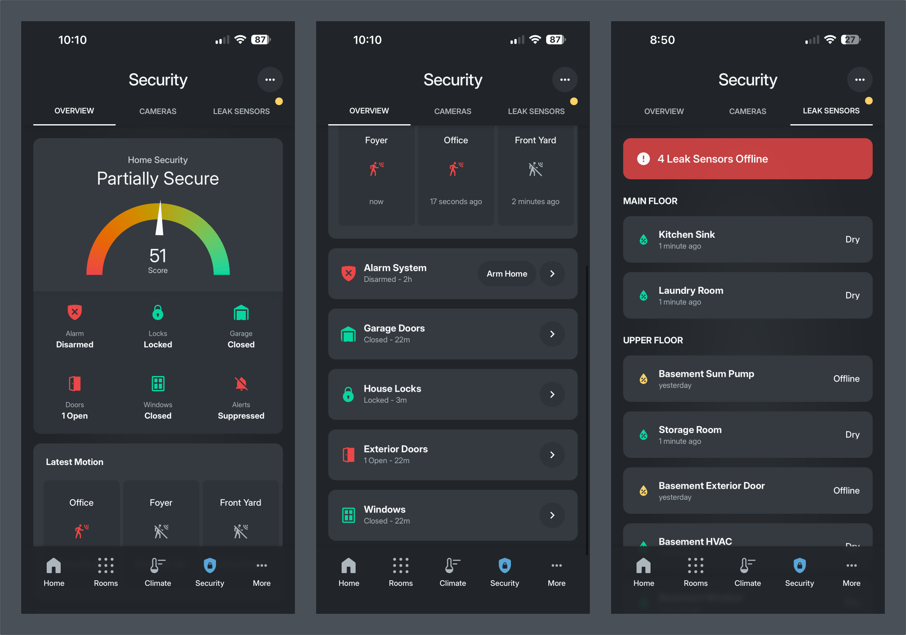
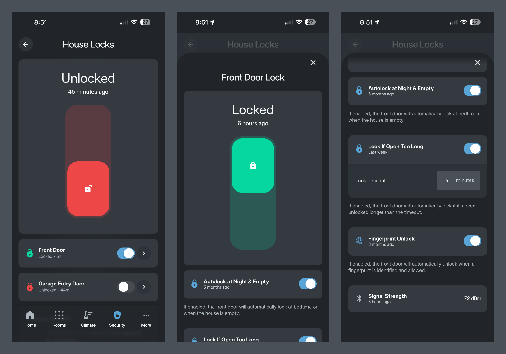
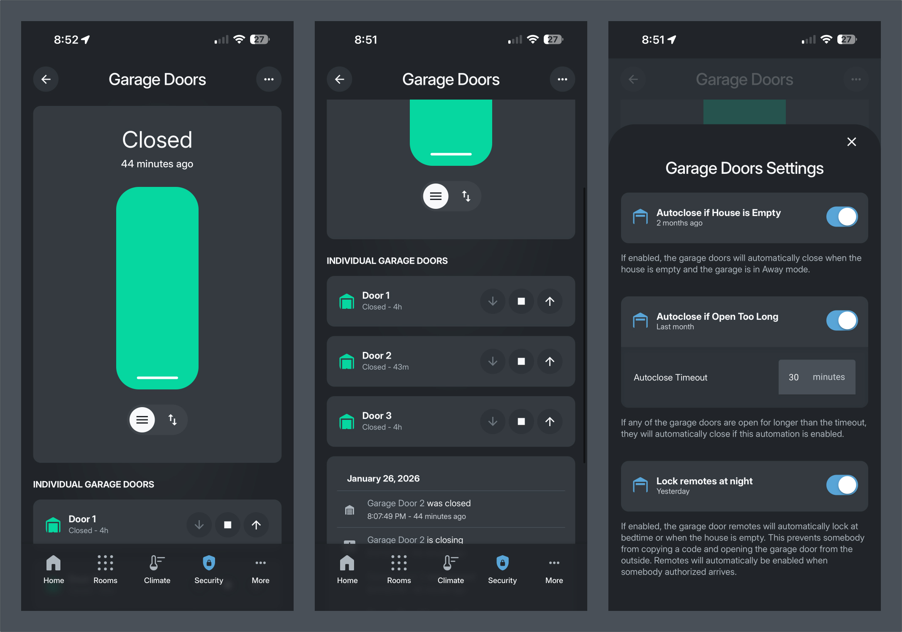
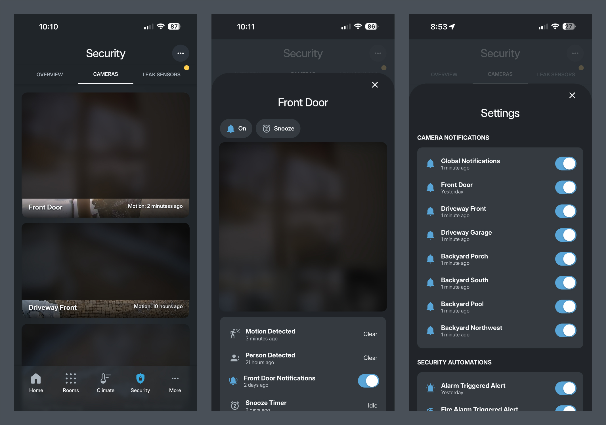

# Security Dashboard



Comprehensive security monitoring and control for the house. Monitor locks, doors, windows, cameras, alarms, and leak sensors from a centralized security dashboard.

## Overview

The Security dashboard provides:

- **Security Overview** - Real-time security status and custom security score
- **Alarm Panel** - Arm/disarm controls and automation settings
- **House Locks** - Front door and garage entry door lock controls
- **Garage Doors** - Three garage door controls with automation settings
- **Exterior Doors** - Monitor and control all exterior doors
- **Windows** - Window status monitoring and alerts
- **Leak Sensors** - Water leak detection across all floors
- **Cameras** - Live camera feeds and motion detection
- **Motion Detection** - Latest motion events from security sensors
- **Security Settings** - Centralized security automation controls

## File Structure

```
security/
├── README.md                                    # This file
├── security.yaml                                # Main security dashboard page
├── front_door_lock_popup.yaml                  # Front door lock popup
├── garage_entry_lock_popup.yaml                # Garage entry door lock popup
├── house_locks_popup.yaml                      # House locks overview popup
├── components/
│   ├── front_door_lock_component.yaml          # Front door lock component
│   ├── garage_entry_door_lock_component.yaml   # Garage entry door lock component
│   └── security_settings_popup.yaml            # Security settings popup
├── pages/
│   ├── house_locks.yaml                        # House locks detail page
│   ├── garage_doors.yaml                       # Garage doors detail page
│   ├── alarm_panel.yaml                        # Alarm panel detail page
│   ├── exterior_doors.yaml                     # Exterior doors detail page
│   ├── windows.yaml                            # Windows detail page
│   └── leak_sensors.yaml                       # Leak sensors detail page
└── cameras/
    ├── cameras.yaml                            # Cameras overview page
    ├── _front_door_camera_popup.yaml           # Front door camera popup
    ├── _driveway_front_camera_popup.yaml        # Driveway front camera popup
    ├── _garage_driveway_camera_popup.yaml      # Garage driveway camera popup
    ├── _backyard_south_camera_popup.yaml       # Backyard south camera popup
    ├── _backyard_porch_camera_popup.yaml       # Backyard porch camera popup
    ├── _backyard_pool_camera_popup.yaml        # Backyard pool camera popup
    └── _backyard_northwest_camera_popup.yaml   # Backyard northwest camera popup
```

_Note: The file structure is a little confusing and needs some work_

## Main Security Page

The main security dashboard (`security.yaml`) provides a comprehensive overview of the house's security status.

### Page Header

Standard security header with:
- **Page Title** - "Security"
- **Settings Button** - Opens security settings popup

Uses `security_header` include template.

### Security Overview Section

Two-card stack showing:

1. **Home Security Status Card**
   - Displays current security status from `sensor.house_security_status`
   - Shows status text (e.g., "Secure", "Unsecure")
   - Large, centered text for quick visibility

2. **Security Score Gauge**
   - Visual gauge showing security score (0-100)
   - Color gradient from red (0) to green (100)
   - Displays score from `sensor.house_security_score` (see [security score sensor](../../../packages/security/security_score.yaml))
   - Needle-style gauge with custom styling

### Security Items Grid

Horizontal grid showing quick status for key security components:

**Row 1:**
- **Alarm** - Current alarm state (Disarmed, Armed Home, Armed Away)
  - Navigates to Alarm Panel page
  - Custom icons for each state
- **Locks** - House locks status
  - Shows "Locked" or count of unlocked doors
  - Navigates to House Locks page
- **Garage** - Garage doors status
  - Shows "Closed" or count of open doors
  - Navigates to Garage Doors page

**Row 2:**
- **Doors** - Exterior doors status
  - Shows count of open doors or "Closed"
  - Color-coded (red for open, green for closed)
  - Navigates to Exterior Doors page
- **Windows** - Windows status
  - Shows count of open windows or "Closed"
  - Color-coded (red for open, green for closed)
  - Navigates to Windows page
- **Alerts** - Camera notifications toggle
  - Shows "Active" or "Suppressed"
  - Controls `input_boolean.camera_notifications`

### Latest Motion Detections

Horizontal scrolling list of recent motion detections:
- Shows motion sensors that detected motion in the last 2 minutes
- Auto-sorted by most recent first
- Uses `motion_detected_card` template
- Excludes certain sensors (Frigate cameras, room presence sensors, etc.)
- Scrollable horizontal layout

### Navigation Cards

Large navigation cards linking to security sub-pages:

- **House Locks** - Navigate to house locks detail page
- **Garage Doors** - Navigate to garage doors detail page
- **Exterior Doors** - Navigate to exterior doors detail page
- **Windows** - Navigate to windows detail page

Each card uses `horizontal_action_card` decluttering template with navigation actions.

### Popups

- **Front Door Lock Popup** - Front door lock controls
- **Garage Entry Lock Popup** - Garage entry door lock controls
- **Security Settings Popup** - Security automation settings

## Security Sub-Pages

### House Locks (`pages/house_locks.yaml`)



Detailed view of all house locks with individual controls.

**Features:**
- **House Locks Overview** - More-info card for `lock.house_locks` group
- **Front Door Lock Component** - Full lock control with popup
- **Garage Entry Door Lock Component** - Full lock control with popup
- **Logbook** - 48-hour history of lock events

**Components:**
- Uses `front_door_lock_component.yaml` and `garage_entry_door_lock_component.yaml`
- Each component includes:
  - Lock status and control
  - Lock/unlock toggle switch
  - Navigation to detailed popup

**Popups:**
- Front Door Lock Popup (`#front_door_lock_popup`)
- Garage Entry Lock Popup (`#garage_entry_lock_popup`)

### Garage Doors (`pages/garage_doors.yaml`)



Control and monitor all garage doors with automation settings.

**Features:**
- **Garage Doors Overview** - More-info card for `cover.garage_doors` group
- **Individual Garage Doors** - Three separate garage door controls:
  - Garage Door 1 (`cover.garage_door_1`)
  - Garage Door 2 (`cover.garage_door_2`)
  - Garage Door 3 (`cover.garage_door_3`)
- **Logbook** - 48-hour history of garage door events

**Settings Popup** (`#garage_doors_settings_popup`):
- **Autoclose if House is Empty** - Automation toggle
  - `automation.garage_doors_close_when_empty_house`
  - Closes garage doors when house is empty and in Away mode
- **Autoclose if Open Too Long** - Automation toggle with timeout
  - `automation.garage_doors_close_when_home`
  - `input_number.garage_doors_close_when_home_timeout` (configurable timeout)
  - Automatically closes doors if open longer than timeout
- **Lock Remotes at Night** - Automation toggle
  - `automation.garage_doors_lock_remotes`
  - Locks garage door remotes at bedtime or when house is empty
  - Prevents unauthorized access via copied codes
  - Automatically enables when authorized person arrives

**Components:**
- Uses `horizontal_garage_door_card` decluttering template for each door

### Alarm Panel (`pages/alarm_panel.yaml`)

Alarm system control and automation configuration.

**Features:**
- **Alarm Panel Overview** - More-info card for `alarm_control_panel.alarmo`
- **Logbook** - 48-hour history of alarm events

**Settings Popup** (`#alarm_panel_settings_popup`):

**Occupancy Automations:**
- **Arm When House is Empty** - `automation.alarm_arm_when_house_is_empty`
- **Disarm When House is Occupied** - `automation.alarm_disarm_when_house_becomes_occupied`
- **Disarm When Somebody Arrives** - `automation.alarm_disarm_when_somebody_arrives_and_house_occupied`
- Description: Automatically manages alarm based on house occupancy. Only people with unlock privileges can disarm.

**Bedtime Automations:**
- **Arm at Bedtime** - `automation.alarm_arm_at_bedtime`
- **Disarm in Morning** - `automation.alarm_disarm_in_morning`
- Description: Automatically arms at bedtime and disarms in the morning.

**Misc Automations:**
- **Early Arming When John is Away** - `automation.activate_alarm_automation_if_john_away`
- When enabled, shows configurable arm time: `input_datetime.alarm_john_away_arm_time`
- Description: Activates when John is away for 2+ hours or out of town. Automatically arms at specified time.

### Exterior Doors (`pages/exterior_doors.yaml`)

Monitor and control all exterior doors.

**Features:**
- Individual door status cards for:
  - Front Door (`binary_sensor.front_door`)
  - Interior Garage Door (`binary_sensor.interior_garage_door`)
  - Kitchen Patio Door (`binary_sensor.kitchen_patio_door`)
  - Kitchen Sunroom Door (`binary_sensor.kitchen_sunroom_door`)
  - Family Room Left Door (`binary_sensor.family_room_left_door`)
  - Family Room Right Door (`binary_sensor.family_room_right_door`)
  - Basement Exterior Door (`binary_sensor.basement_exterior_door`)
  - Upstairs Guest Bedroom Door (`binary_sensor.upstairs_guest_bedroom_door`)

**Settings Popup** (`#exterior_doors_settings_popup`):
- **Door Left Open Alert** - `automation.door_left_open`
- Sends notification when a door is left open for too long

**Components:**
- Uses `kohbo_device_door_entity_horizontal` button card template

### Windows (`pages/windows.yaml`)

Monitor window status and receive alerts.

**Features:**
- Individual window status cards for:
  - Kitchen Window (`binary_sensor.kitchen_window_sensor`)
  - Kitchen West Middle Window (`binary_sensor.kitchen_window_west_middle_sensor`)
  - Playroom Window (`binary_sensor.playroom_window_sensor`)
  - Playroom West Left Opening (`binary_sensor.playroom_window_west_left_opening`)
  - Office Window (`binary_sensor.office_window_sensor`)

**Settings Popup** (`#windows_settings_popup`):
- **Window Left Open Alert** - `automation.window_left_open`
- Sends notification when a window is left open for too long

**Components:**
- Uses `kohbo_device_window_entity_horizontal` button card template

### Leak Sensors (`pages/leak_sensors.yaml`)

Water leak detection across all floors and areas.

**Features:**
- **Offline Sensors Alert** - Shows count of unavailable leak sensors when any are offline
- Organized by location:

**Main Floor:**
- Kitchen Sink (`binary_sensor.kitchen_sink_leak_sensor`)
- Laundry Room (`binary_sensor.laundry_room_leak_sensor`)

**Basement:**
- Basement Sum Pump (`binary_sensor.basement_sum_pump_leak_sensor`)
- Storage Room (`binary_sensor.storage_room_leak_sensor`)
- Basement Exterior Door (`binary_sensor.basement_exterior_door_leak_sensor`)
- Basement HVAC (`binary_sensor.leak_sensor_hvac_moisture`)
- Basement Window (`binary_sensor.basement_window_leak_sensor_moisture`)
- Basement Bathroom (`binary_sensor.leak_sensor_basement_bathroom_moisture`)

**Upper Floor:**
- Main Bathroom (`binary_sensor.main_bathroom_leak_sensor_moisture`)
- Nino's Bathroom (`binary_sensor.nino_s_bathroom_leak_sensor_moisture`)
- Upstairs Laundry (`binary_sensor.upstairs_laundry_leak_sensor`)
- Upstairs Hallway Bathroom (`binary_sensor.upstairs_hallway_bathroom_leak_sensor_moisture`)

**Attic:**
- Attic Furnace Pan (`binary_sensor.furnace_pan_leak_sensor_moisture`)

**Components:**
- Uses `kohbo_device_leak_entity_horizontal` button card template
- Red alert banner when sensors are offline

## Cameras (`cameras/cameras.yaml`)



Live camera feeds and motion detection overview.

**Features:**
- **Camera Cards** - Grid of all security cameras
- Each camera card shows:
  - Live stream preview
  - Camera name
  - Motion detection status
  - Tap to open full-screen popup

**Available Cameras:**
- Front Door (`#front_door_camera`)
- Driveway Front (`#driveway_front_camera`)
- Garage Driveway (`#garage_driveway_camera`)
- Backyard South (`#backyard_south_camera`)
- Backyard Porch (`#backyard_porch_camera`)
- Backyard Pool (`#backyard_pool_camera`)
- Backyard Northwest (`#backyard_northwest_camera`)

**Camera Popups:**
Each camera has a dedicated popup with:
- Full-screen live stream
- Motion detection status
- Camera controls
- Stream quality options

**Components:**
- Uses `camera_card` decluttering template
- Each card includes:
  - Hash for popup navigation
  - Camera name
  - Stream ID (low quality for preview)
  - Motion entity for status

## Components Used

### Decluttering Templates

- **`camera_card`** - Camera preview card with motion status
- **`camera_popup`** - Full-screen camera popup
- **`horizontal_action_card`** - Navigation cards for sub-pages
- **`horizontal_garage_door_card`** - Garage door control card
- **`room_page_top_toolbar`** - Standard page header with back button and settings
- **`security_header`** - Security page header with settings button

### Button Card Templates

- **`kohbo_security_item`** - Security status item (alarm, locks, garage, etc.)
- **`kohbo_device_door_entity_horizontal`** - Horizontal door status card
- **`kohbo_device_window_entity_horizontal`** - Horizontal window status card
- **`kohbo_device_leak_entity_horizontal`** - Horizontal leak sensor card
- **`kohbo_horizontal_action_card_lock_entity`** - Lock action card
- **`kohbo_chip_icon_action_card`** - Icon action chip
- **`section_title`** - Section header card
- **`kohbo_popup_page_title`** - Popup page title
- **`kohbo_card_section_description`** - Description text card

### Include Templates

- **`security_header.yaml`** - Security page header component
- **`front_door_lock_component.yaml`** - Front door lock component
- **`garage_entry_door_lock_component.yaml`** - Garage entry door lock component
- **`security_settings_popup.yaml`** - Security settings popup

## Key Entities

### Security Status
- `sensor.house_security_status` - Overall security status
- `sensor.house_security_score` - Security score (0-100)
- `input_boolean.camera_notifications` - Camera notification toggle

### Alarm
- `alarm_control_panel.alarmo` - Main alarm panel

### Locks
- `lock.house_locks` - House locks group
- `lock.front_door` - Front door lock
- `lock.garage_entry_door` - Garage entry door lock
- `switch.front_door_lock_switch` - Front door lock toggle
- `switch.house_locks_switch` - House locks toggle

### Garage Doors
- `cover.garage_doors` - Garage doors group
- `cover.garage_door_1` - Garage door 1
- `cover.garage_door_2` - Garage door 2
- `cover.garage_door_3` - Garage door 3

### Doors & Windows
- `binary_sensor.exterior_doors` - Exterior doors group
- `binary_sensor.windows` - Windows group
- Individual door/window sensors (see respective pages)

### Leak Sensors
- `sensor.leak_sensors_unavailable` - Count of unavailable sensors
- Individual leak sensors (see Leak Sensors page)

### Motion Sensors
- Various `binary_sensor.*_motion` entities for motion detection

## Security Automations

The security dashboard integrates with several automations:

### Alarm Automations
- `automation.alarm_arm_when_house_is_empty`
- `automation.alarm_disarm_when_house_becomes_occupied`
- `automation.alarm_disarm_when_somebody_arrives_and_house_occupied`
- `automation.alarm_arm_at_bedtime`
- `automation.alarm_disarm_in_morning`
- `automation.activate_alarm_automation_if_john_away`

### Garage Door Automations
- `automation.garage_doors_close_when_empty_house`
- `automation.garage_doors_close_when_home`
- `automation.garage_doors_lock_remotes`

### Door/Window Automations
- `automation.door_left_open`
- `automation.window_left_open`

## Example YAML

### Main Security Page

```yaml
type: custom:vertical-layout
title: Security
path: security
theme: kohbo
layout: !include /config/dashboards/templates/includes/layouts/kohbo_page_layout_tabbed_nav.yaml
cards:
  # Page Header
  - !include /config/dashboards/templates/includes/security/security_header.yaml

  # Security Overview
  - type: custom:stack-in-card
    cards:
      - type: custom:button-card
        entity: sensor.house_security_status
        name: Home Security
        show_icon: false
        show_state: true
      
      - type: gauge
        name: Score
        entity: sensor.house_security_score
        min: 0
        max: 100
        needle: true
```

### Security Item Card

```yaml
- type: custom:button-card
  entity: alarm_control_panel.alarmo
  name: Alarm
  template: kohbo_security_item
  state:
    - value: 'disarmed'
      icon: kohbo:kohbo-alarm-disarmed
    - value: 'armed_home'
      icon: kohbo:kohbo-alarm-armed-home
    - value: 'armed_away'
      icon: kohbo:kohbo-alarm-armed-away
  tap_action:
    action: navigate
    navigation_path: '/dashboard-kohbo/security-alarm-panel'
```

### Camera Card

```yaml
- type: custom:decluttering-card
  template: camera_card
  variables:
    - hash: '#front_door_camera'
    - name: Front Door
    - stream_id: front_door_low
    - motion_entity: binary_sensor.front_door_camera_motion
```

## Navigation

The security dashboard uses the following navigation paths:

- `/dashboard-kohbo/security` - Main security page
- `/dashboard-kohbo/security-house-locks` - House locks page
- `/dashboard-kohbo/security-garage-doors` - Garage doors page
- `/dashboard-kohbo/security-alarm-panel` - Alarm panel page
- `/dashboard-kohbo/security-exterior-doors` - Exterior doors page
- `/dashboard-kohbo/security-windows` - Windows page
- `/dashboard-kohbo/security-cameras` - Cameras page
- `/dashboard-kohbo/security-leak-sensors` - Leak sensors page

Popup hashes:
- `#front_door_lock_popup` - Front door lock popup
- `#garage_entry_lock_popup` - Garage entry lock popup
- `#house_locks_popup` - House locks popup
- `#security_settings_popup` - Security settings popup
- `#alarm_panel_settings_popup` - Alarm panel settings popup
- `#garage_doors_settings_popup` - Garage doors settings popup
- `#exterior_doors_settings_popup` - Exterior doors settings popup
- `#windows_settings_popup` - Windows settings popup
- `#front_door_camera` - Front door camera popup
- `#driveway_front_camera` - Driveway front camera popup
- (and other camera popups)

---

## Dashboard Navigation

[🏠 Home](../home/README.md) | [🏡 Rooms](../rooms/README.md) | [🌡️ Climate](../climate/README.md) | [🔒 Security](../security/README.md) | [⚡ Energy](../energy/README.md) | [👥 People](../more/PEOPLE_README.md)

📖 [Main Dashboard README](../../README.md) | 🗺️ [Sitemap](../../SITEMAP.md)
